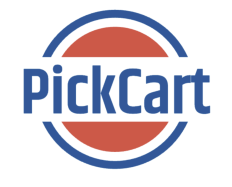

# Online Shopping Mall Project(PickCart)

This project is a shopping mall management system that allows users to manage various aspects of a shopping mall, such as stores, products, and customer information. It provides features for adding, updating, and deleting stores and products, as well as tracking customer purchases and generating reports.

## Getting Started

1. Clone the project: `git clone <project-url>`
2. Install dependencies: `npm install`
3. Start the development server: `npm run dev`

## Pages

- Getting Started
- Cart View
- Login View
- Sign Up Page
- AI Chat Bot

## Features

- [Describe the features of the application here]

## Screenshots

## Authors

# Shopping Mall Project

This project is a shopping mall management system that allows users to manage various aspects of a shopping mall, such as stores, products, and customer information. It provides features for adding, updating, and deleting stores and products, as well as tracking customer purchases and generating reports.

## Getting Started

1. Clone the project: `git clone <project-url>`
2. Install dependencies: `npm install`
3. Start the development server: `npm run dev`

## Pages

- Getting Started
- Cart View
- Login View
- Sign Up Page
- AI Chat Bot

## Features

- [Describe the features of the application here]

## Screenshots

## Authors

- PickCart team

## Version

- 1.0
- PickCart team

## Version

- 1.0
